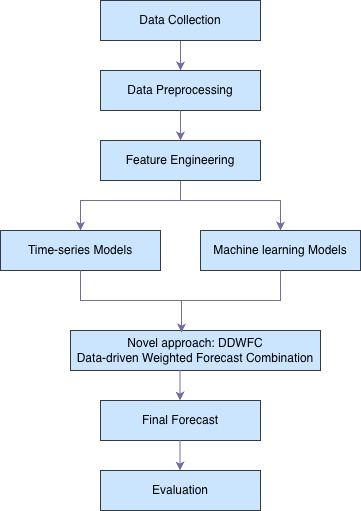
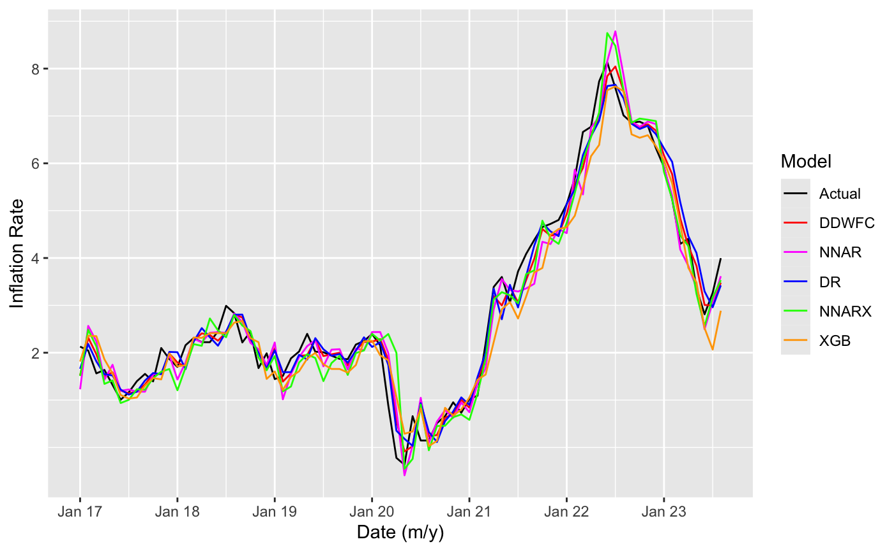
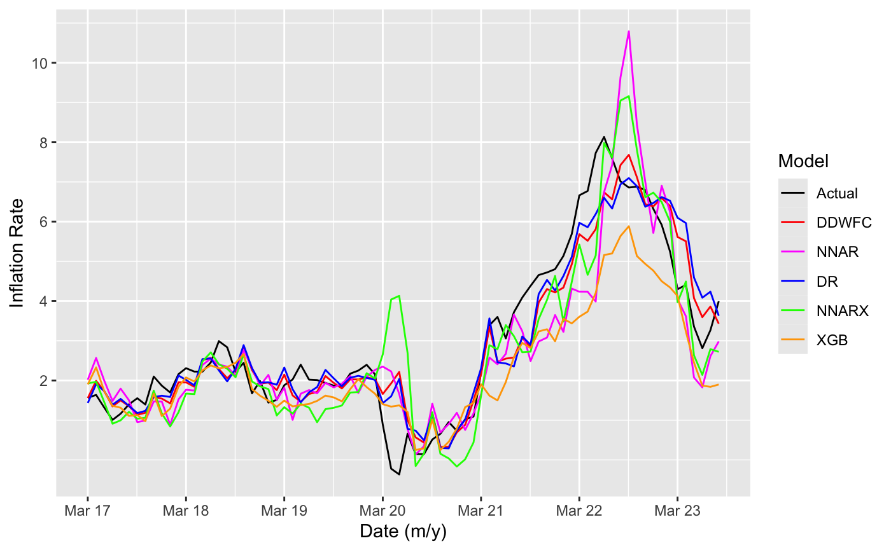
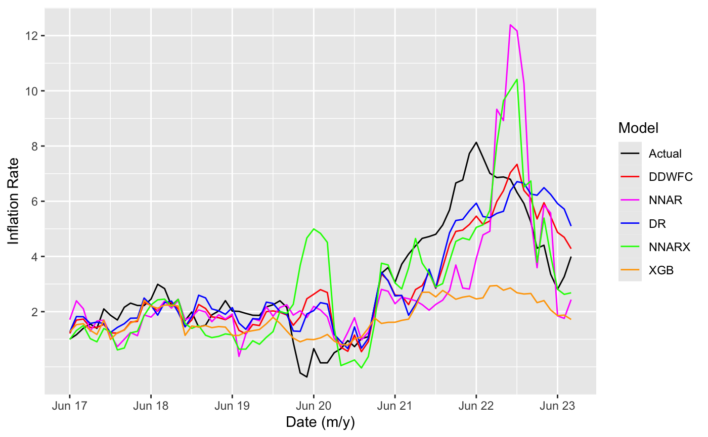
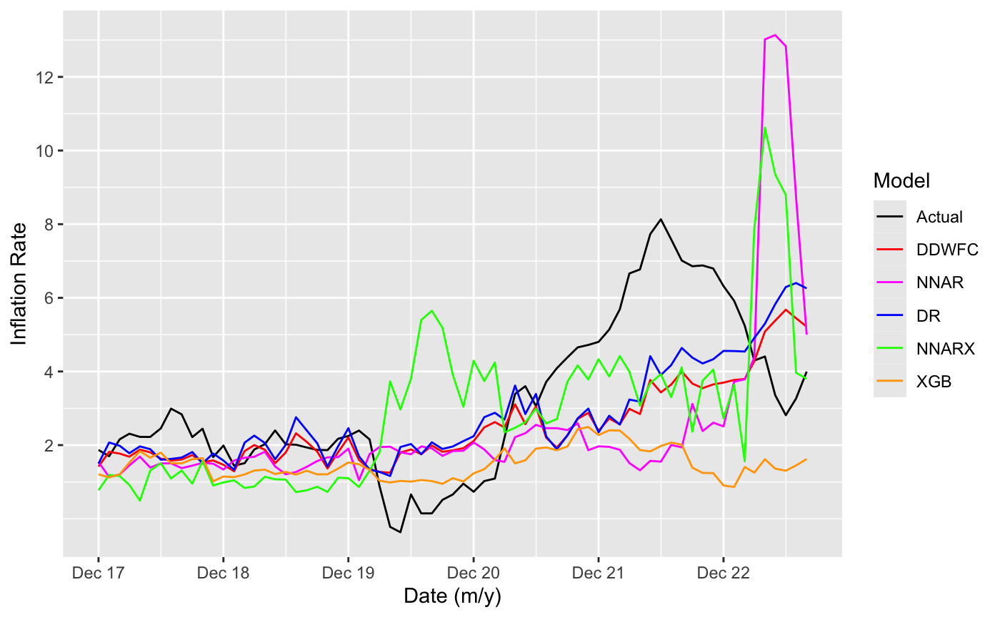

# Optimizing Canada's Inflation: A Novel Approach

## Overview
Inflation, the rise in prices over time, plays a crucial role in determining a nation’s economic stability and impacts the cost of living 💸. This study aims to forecast Canada’s inflation using a **novel data-driven forecast combination approach**, addressing gaps in Canadian inflation research.

Inflation is influenced by various economic factors such as exchange rates 💱, unemployment rates 📉, and more. This approach incorporates these external factors to accurately capture inflation variations. The proposed method combines **time series 📊** and **machine learning 🤖** models, optimizing forecast weights by minimizing the **forecast error sum of squares (FESS)**.

---

## Methodology 🛠️
- **Data Sources:** Canadian inflation data from [FRED](https://fred.stlouisfed.org/) and [Bank of Canada](https://www.bankofcanada.ca/) 🏦  
- **Approach:** Hybrid of time series and machine learning models, combining forecasts with optimized weights to maximize accuracy 🎯

---

## Achievements 🏆
- **Poster Award:** Best Poster Presentation at the Canadian Statistics Student Conference, St. John, June 2024 🎉  
- **Code:** Will be released soon 🔓

---

## Architecture

  

*Figure 1: Data-driven Forecast Combination Pipeline*

---

## Results 📊
The numerical experiments indicate that the proposed approach outperforms traditional time series and machine learning models, offering superior accuracy and reliability in forecasting Canadian inflation. This approach provides valuable insights for policymakers 🏛️.

<table>
<tr>
<td></td>
<td></td>
</tr>
<tr>
<td></td>
<td></td>
</tr>
</table>

*Figure 2: Forecasting Results – Actual vs Predicted Inflation across Horizons*

---

## Paper & Code
- [View Thesis Paper](https://tru.arcabc.ca/node/627)  
- Full code for this project will be released soon 🔜

---

## Future Scope
- Integrate volatility models (GARCH)  
- Add global economic indicators  
- Build a real-time forecasting pipeline  
- Develop an interactive dashboard for policy insights
